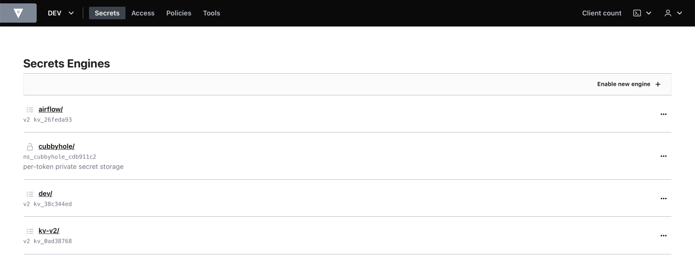
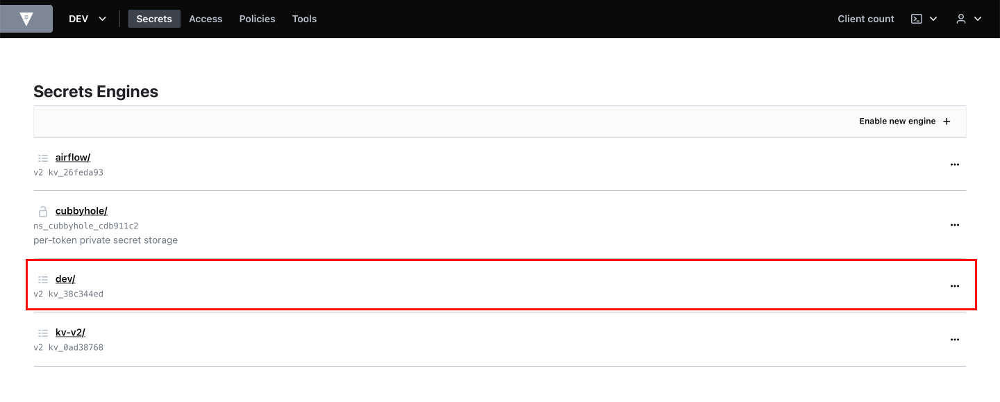

# Create Secrets on Hashicorp Vault Web UI
---
## Step 1: Sign in to Vault

Access [pam-dev.uhc.com](http://pam-dev.uhc.com) on a web browser (the follwing browsers are supported: Chrome, Firefox, Safari, and Microsoft Edge) and sign in to Vault.  
**Note:**  It is important to provide a correct **Namespace**  

1. Fill out **Namespace** with **"/OPTUM/APP/AIRFLOW"**
2. Choose **LDAP** method
3. Fill out your **Username** and **Password**
4. Click on **Sign In** button

## Step 2: Switch to your target Namespace

After signing in to Vault, you will see the following main page of the Vault Web UI:  
  

1. Click on the arrow down icon next to **AIRFLOW**, then a drop-down menu will appear. Click on **Manage namespaces**

2. After clicking on **Manage namespaces**, a list of Namespaces will show up

3. Click on **...** (three horizontal dots icon) next to your target Namespace and choose **Switch to Namespace**

## Step 3: Choose your engine
After switching to your target Namespace, a list of engines will show up

Click on your target engine

## Step 4: Create a secret
1. Click on **Create secret** to create a new secret

2. Fill out **secret path** and **Secret data**

3. Click on **Save** button

## Step 5: Continue creating remaining secrets

## Examples of results

