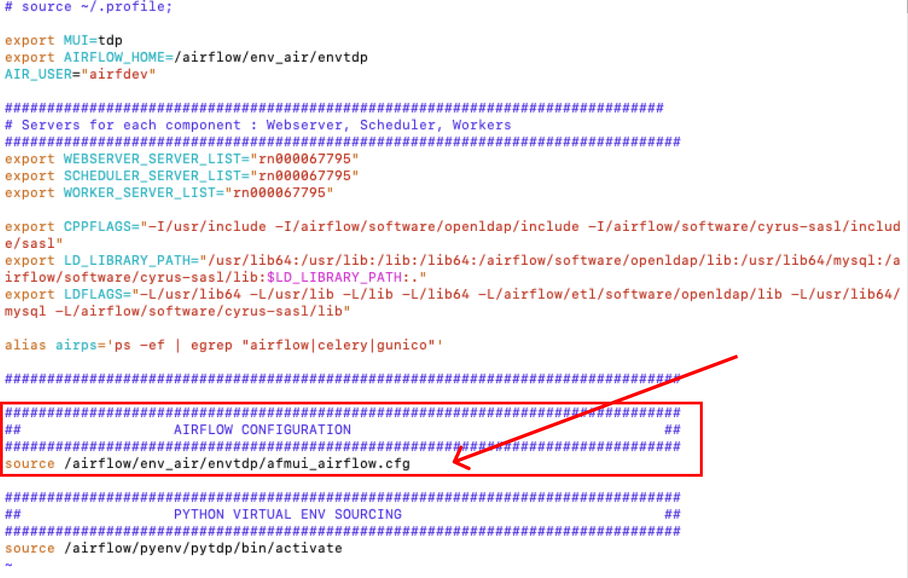
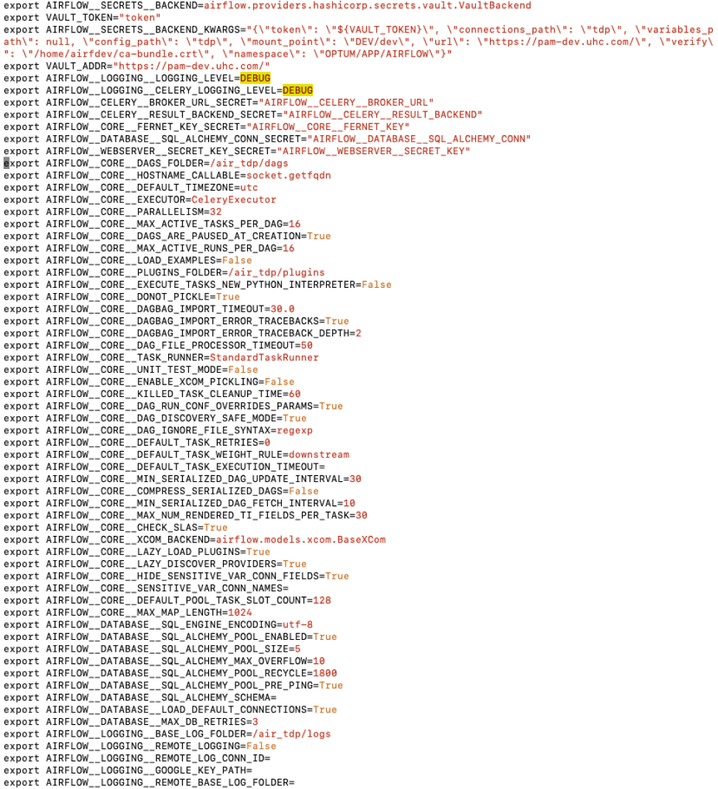

# Setting

---
## airflow.cfg
The first time you run Airflow, it will create a file called **airflow.cfg** in your **$AIRFLOW_HOME** directory (~/airflow by default). This file contains Airflow’s configuration and you can edit it to change any of the settings. You can also set options with environment variables by using this format: **AIRFLOW__{SECTION}__{KEY}** (note the double underscores).

For example, the metadata database connection string can either be set in airflow.cfg like this:
```
[database]
sql_alchemy_conn = my_conn_string
```
or by creating a corresponding environment variable:
```
export AIRFLOW__DATABASE__SQL_ALCHEMY_CONN=my_conn_string
```
## Override airflow.cfg
The airflow.cfg comes from the default installation and stays unchanged. We can create a new configuration and create new environment variables in it to overwrite airflow.cfg  
1. Create a new configuration file in the same directory as airflow.cfg  
    ```
    $ touch afmui_airflow.cfg
    ```
2. Open and update airflow setup sh file (airtdp_env_setup.sh)
    ```
    $ vim airtdp_env_setup.sh
    ```
    Update source file in AIRFLOW CONFIGURATION section to afmui_airflow.cfg:
    from
    
    to
    

3. Add environment variables in afmui_airflow.cfg configuration file
    
