# Create Secrets on Hashicorp Vault Web UI

---
## Step 1: Sign in to Vault

Access [pam-dev.uhc.com](http://pam-dev.uhc.com) on a web browser (the follwing browsers are supported: Chrome, Firefox, Safari, and Microsoft Edge) and sign in to Vault.  

1. Fill out **Namespace** with **"/OPTUM/APP/AIRFLOW"**.  
**Note:** This is **namespace** value in **Airflow** configuration.
2. Choose **LDAP** method.
3. Fill out your **Username** and **Password**.
4. Click on **Sign In** button.

## Step 2: Switch to your target Namespace

After signing in to Vault, you will see the following main page of the Vault Web UI:  
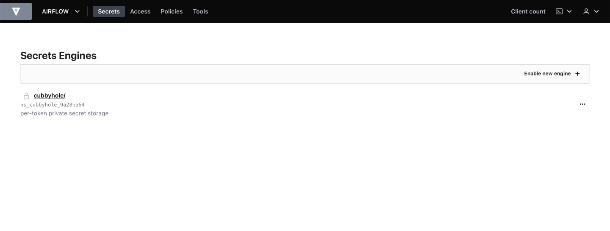  

1. Click on the arrow down icon next to **AIRFLOW**, then a drop-down menu will appear. Click on **Manage namespaces**.
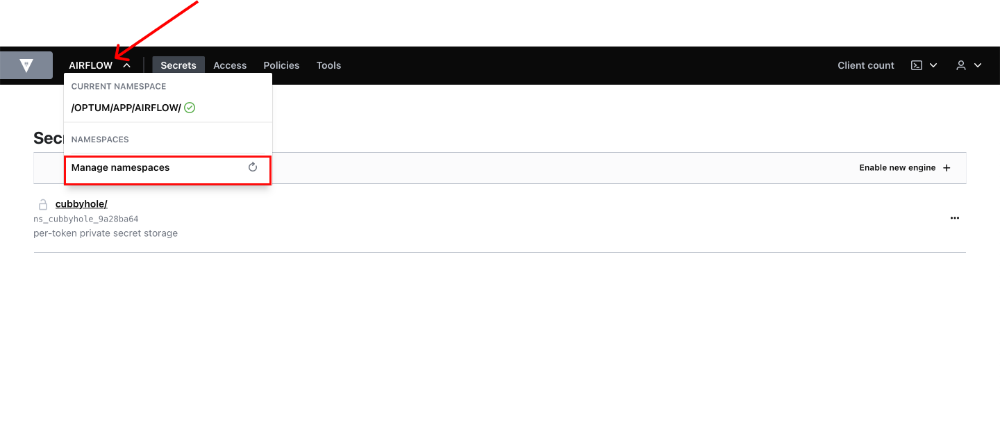
2. After clicking on **Manage namespaces**, a list of Namespaces will show up.

3. Click on **...** (three horizontal dots icon) next to your target Namespace and choose **Switch to Namespace**.
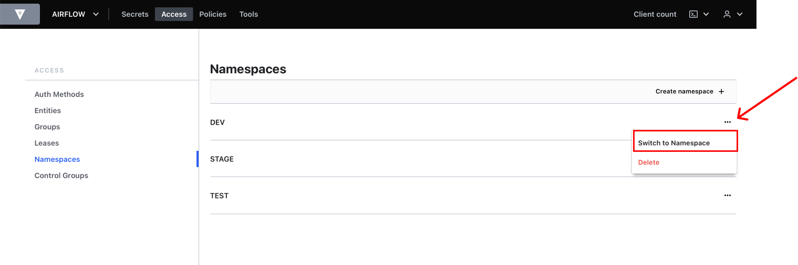

## Step 3: Choose your engine
After switching to your target Namespace, a list of engines will show up.
Click on your target engine.
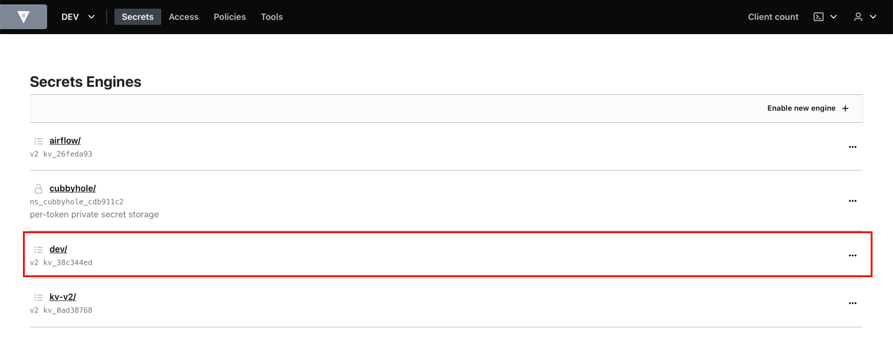

## Step 4: Create a secret
1. Click on **Create secret** to create a new secret.
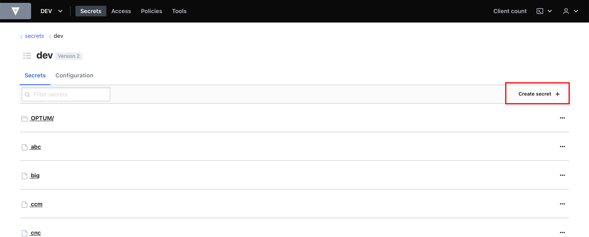
2. Fill out **secret path** and **Secret data**.    
    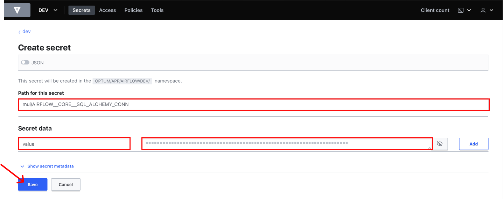
    
    !!! note

        - Each secret has its own unique path generated by providing **"[parentFolder]/[secretName]"**.  
        - This **parentFolder** is used as **config_path** in Airflow configuration.  
        - Key of Secret data must be "value" for all secrets.  

3. Click on **Save** button.
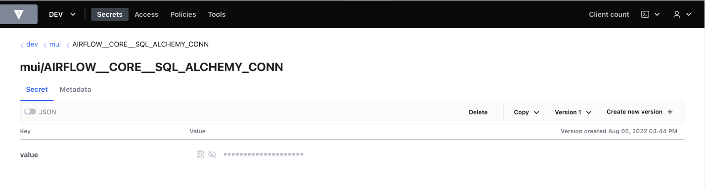

## Step 5: Continue creating remaining secrets
1. Click on **[parentFolder]** on the top left path to navigate to the secret's parent folder.
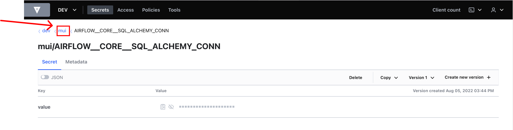
2. Click on **Creat secret** to create another secret.
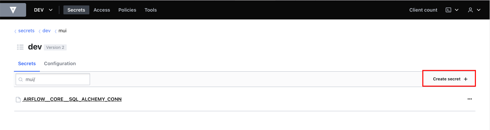
3. Similar to step 4, fill out **secret path** and **secret data** boxes.
    
    !!! note

        - parentFolder must be the same as the previous secret's parentFolder.    
        - The secret path has to be in form **"[parentFolder]/[secretName]"**.    
        - Secret Key is "value" for all secrets.  

    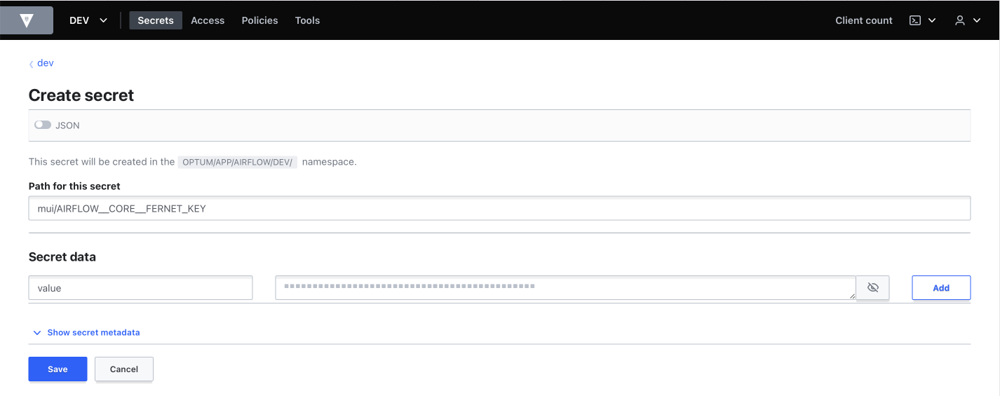  
4. Continue creating remaining secrets.

## Examples of results
### An example of correct result of creating secrets:
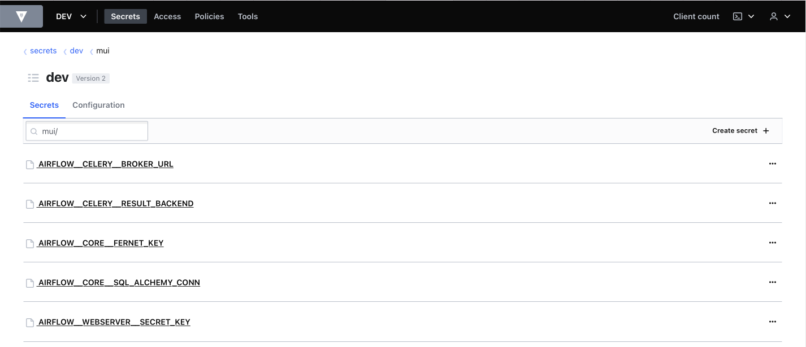
*Each secret has its own unique path.*
### An example of wrong result of creating secrets:
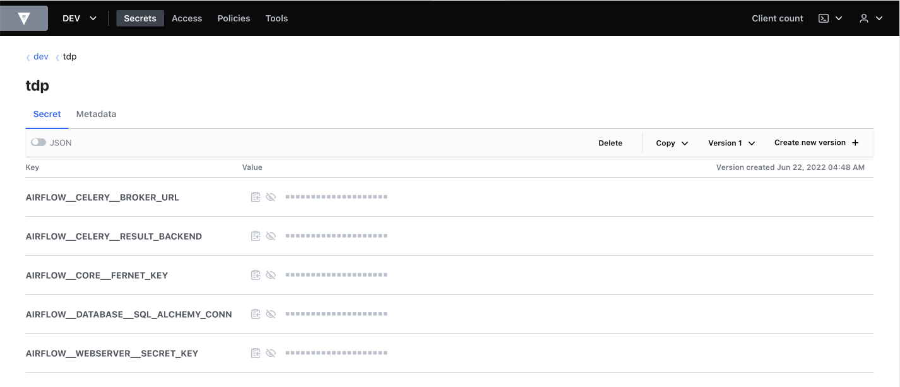
*All screts are in the same path which is "/[config_path]". Secrets are in json format with key is [secretName].*
