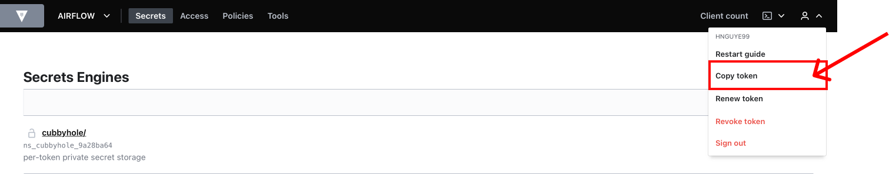

# How to Get Token

## Step 1: Sign in to Vault
Access [pam-dev.uhc.com](http://pam-dev.uhc.com) on a web browser (the follwing browsers are supported: Chrome, Firefox, Safari, and Microsoft Edge) and sign in to Vault.  

1. Fill out **Namespace** with **"/OPTUM/APP/AIRFLOW"**.  
**Note:** This is **namespace** value in **Airflow** configuration.
2. Choose **LDAP** method.
3. Fill out your **Username** and **Password**.
4. Click on **Sign In** button.

## Step 2: Copy Token
Click on person icon and choose **Copy token**

## Step 3: Paste the Token
You now can paste the token in your target file.  
!!! note

    Token is used as value of **VAULT_TOKEN** environment variable in Airflow's configuration file.  